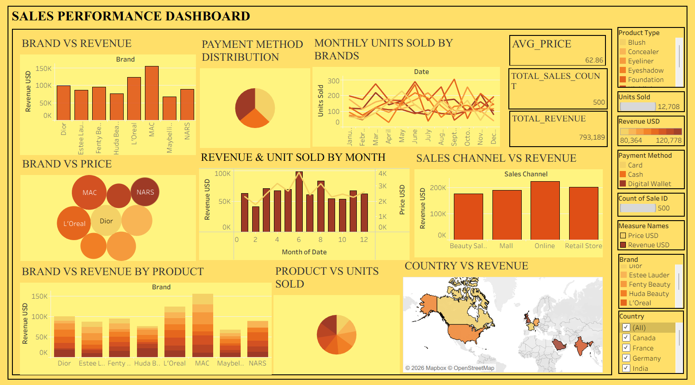

<h1 align="center"> Sales Performance Dashboard (Tableau)</h1>

  <b>Tableau | Business Analytics | Sales & Revenue Insights</b>

<h2> Overview</h2>

This project presents an interactive <b>Sales Performance Dashboard</b> developed using <b>Tableau</b> to deliver comprehensive insights into business performance. 
The dashboard enables detailed analysis of revenue, product performance, and sales distribution across multiple dimensions such as brands, channels, and regions. 

It is designed to support data-driven decision-making by providing a clear and intuitive view of key performance indicators, sales trends, and customer purchasing behavior. 
The visualizations help identify high-performing areas, uncover growth opportunities, and optimize overall sales strategy.

<h2> Objective</h2>

The objective of this project is to analyze sales data and develop an interactive dashboard that provides actionable insights into revenue performance, product trends, and customer purchasing patterns. 

The dashboard aims to help identify key growth drivers, evaluate the effectiveness of sales channels, and support strategic decision-making through clear and data-driven visualizations.

<h2> Dashboard Preview</h2>

  

<h2> Key Metrics</h2>
<ul>
  <li>Total Revenue</li>
  <li>Total Units Sold</li>
  <li>Average Product Price</li>
  <li>Total Sales Count</li>
</ul>

<h2> Analysis Performed</h2>
<ul>
  <li>Brand-wise revenue comparison</li>
  <li>Monthly sales and units sold trends</li>
  <li>Sales channel performance analysis</li>
  <li>Payment method distribution</li>
  <li>Product category performance</li>
  <li>Country-wise revenue analysis</li>
</ul>

<h2> Tools & Technologies</h2>
<ul>
  <li><b>Tableau</b> – Dashboard creation and visualization</li>
  <li><b>Data Visualization</b> – Charts, maps, and KPIs</li>
  <li><b>Data Analysis</b> – Trend and performance analysis</li>
</ul>

<h2> Data Description</h2>

The dataset includes the following fields:

<ul>
  <li>Brand</li>
  <li>Product Type</li>
  <li>Sales Channel</li>
  <li>Payment Method</li>
  <li>Units Sold</li>
  <li>Revenue (USD)</li>
  <li>Price per Product</li>
  <li>Country</li>
  <li>Date</li>
</ul>

<h2> Key Insights</h2>
<ul>
  <li>Certain brands contribute significantly to total revenue</li>
  <li>Online sales channels generate higher revenue compared to others</li>
  <li>Monthly trends show fluctuations in demand and sales</li>
  <li>Product categories differ in performance and profitability</li>
  <li>Regional sales analysis highlights key markets</li>
</ul>

<h2> Dashboard Features</h2>
<ul>
  <li>Interactive filters (Product Type, Brand, Country)</li>
  <li>KPI cards for quick performance tracking</li>
  <li>Dynamic charts and maps</li>
  <li>User-friendly and visually appealing layout</li>
</ul>

<h2> How to Use</h2>
<ol>
  <li>Download the <b>.twb / .twbx</b> file from this repository</li>
  <li>Open using <b>Tableau Desktop</b></li>
  <li>Use filters and dashboards to explore insights</li>
</ol>

<h2> Project Structure</h2>
<pre>
sales-performance-dashboard
│── sales_performance_dashboard.twb
│── Images/
│   ├── sales_dashboard.png
│── README.md
</pre>

<i>Note: Dataset is embedded within the Tableau workbook.</i>

<h2> Author</h2>

<b>Anjana C</b> 
Aspiring Data Analyst | Passionate about business and data insights

⭐ If you found this project useful, consider giving it a star!

